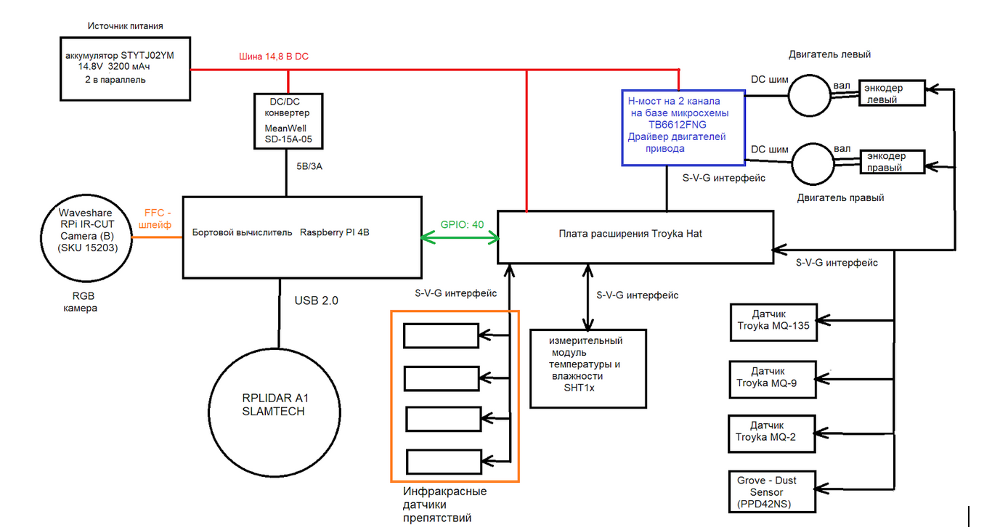

## Отчет по финальной работе по курсу Linux для робототехников

#### 1 Краткое описание мобильного робота

Проектируемый робот относится к мобильным роботам. Его задача - исследование помещений и сбор данных об окружающей среде (температура, влажность, состав воздуха). Робот предназначен для работы в помещениях со сложной планировкой, выполняет построение карты помещения, строит карты распределения температуры, давления, влажности, зоны повышенной концентрации вредных газов, в частности аммиака, бензиновых паров, природного газа, дыма и пыли. 
Робот состоит из следующих систем:

- Системы,подключаемые через GPIO (Troyka Hat S-V-G интерфейс)
  - Измерительный модуль температуры и влажности SHTx
  - Энкодеры левого и правого двигателей
  - Датчики Troyka  MQ-2, MQ-9, MQ135
  - Датчик Grove - Dust Sensor (PPD42NS)
  - Двухканальный H-мост для управления двигателями

- Системы,подключаемые через порт USB
  - RPLIDAR A1 

- Системы,подключаемые через FFC-шлейф в разъём CSI
  - камера Waveshare RPi IR-CUT Camera (B) (SKU 15203)

Программная архитектура
- Операционная система: Ubuntu 20.04
- Для управления: ROS1 Noetic desktop
- Для обработки изображения: OpenCV 
- Для навигации: SLAM-алгоритмы

Структурная схема проектируемого робота представлена на рисунке 1.



Рисунок 1. Структурная схема робота

### Этап 2. Установка ROS2 на Raspberry Pi и настройка рабочей среды
#### 2.1 Установка системы ROS

Установите git с помощью команды 
```bash
sudo apt install git
```

Склонируйте репозиторий с помощью команды
```bash
git clone https://github.com/Silron2402/Linux_final2.git
```

Перейдите в папку Linux_final2/scripts
```bash
cd ./Linux_final2/scripts
```

Запустите скрипт для установки ROS1
```bash
sudo bash ./<путь до папки scripts>/scripts/ros1install.sh
```

Для проверки работоспособности ROS1 необходимо ввести команду в терминале 
```bash
roscore
```

#### 2.2 Создание рабочего пространства ROS
Для создания рабочего пространства выполните следующие действия:

```bash
mkdir -p ~/catkin_ws/src  #Создание структуры каталогов
cd ~/catkin_ws/           #Переход в папку catlkin_ws
catkin_make               #Cборка рабочего пространства
```

3. Активируем рабочее пространство с помощью команды:
```bash
source install/setup.bash
```

### Этап3. Подготовка скрипта для связи с удаленной машиной

Для установки ssh - соединения написан скрипт my_ssh.sh
Содержание скрипта представлено ниже

```bash

#!bin/bash

# Проверяем права суперпользователя
if [ "$(id -u)" != "0" ]; then
    echo "Необходимо запускать скрипт от имени root или с sudo"
    exit 1
fi

#обновим систему
echo "Обновление системы..."
sudo apt update -y

#Выполним установку ssh-сервера
echo "Установка OpenSSH Server..."
sudo apt install -y  openssh-server

#Включение автоматического запуска ssh сервера при старте системы
echo "Включение автозапуска SSH..."
sudo systemctl enable ssh

#старт ssh сервера
echo "Запуск SSH..."
sudo  systemctl start ssh

# Настройка файрвола
echo "Настройка UFW для SSH..."
sudo ufw allow ssh
sudo ufw enable

# Создание резервной копии конфигурации
echo "Создание резервной копии конфигурации..."
sudo cp /etc/ssh/sshd_config /etc/ssh/sshd_config.backup

# Генерация ключей
#echo "Генерация SSH-ключей..."
ssh-keygen -t rsa -b 4096

# Вывод статуса
echo "Проверка статуса SSH..."
sudo systemctl status ssh

echo "Настройка завершена!"

# Указываем хост и порт
_HOST="127.0.0.1"
_PORT=22

# Проверка доступности хоста через ping
ping -q -W 5 -c 1 $_HOST >/dev/null 2>&1
if [ $? -ne 0 ]; then
    echo "Хост недоступен"
    exit 1
fi

# Проверка доступности порта
timeout 5 bash -c "</dev/tcp/$_HOST/$_PORT"
if [ $? -ne 0 ]; then
    echo "Порт 22 недоступен"
    exit 1
fi

# Проверка SSH-подключения
ssh -q -o BatchMode=yes -o StrictHostKeyChecking=no -i /path/to/your/key $_HOST 'exit 0'
_RCODE=$?

if [ $_RCODE -ne 0 ]; then
    echo "Не удалось подключиться по SSH"
    exit 1
else
    echo "SSH-подключение успешно"
    exit 0
fi

```

Для запуска установки следует вызвать команду
```bash
sudo ./<путь до папки scripts>/scripts/my_ssh.sh
``` 

### Этап4. Подготовка и сборка пакетов ROS для функционирования робота
В настоящей работе на робот устанавливаются следующие пакеты и драйверы:
1. [Драйвер для управления лидаром](https://github.com/ros-drivers/velodyne)

2. [Драйвер для работы с usb-камерой](https://github.com/ros-drivers/usb_cam)

3. [Драйвер для работы с датчиком давления газа ВМЕ688](https://github.com/akchobby/bme688_driver)

4. [Драйвер для работы с энкодерами](https://github.com/hiwad-aziz/ros2_f249_driver)

5. [Драйвер для управления приводом робота](https://github.com/odriverobotics/ros_odrive?tab=readme-ov-file)

6. [Драйвер для датчика температуры  давления BM280](https://github.com/JCorbin406/ros2-bmp280.git)

#### 4.1 Установка пакета ROS2 для VeloDyn1RPLIDAR A1
Для установки пакета ROS для RLIDAR  A1 необходимо выполнить следующие действия:
1. Перйдем в папку ```~/ros2_ws/src``` c помощью команды:
```bash
cd ~/ros2_ws/src
```
2. Склонировать репозиторий с помощью команды:
```bash
git clone https://github.com/ros-drivers/velodyne.git
```

3. Перейдем в корневую директорию workspace c помощью команды::
```bash
cd ~/ros2_ws
```
4. Выполним сборку пакета с помощью команды:
```bash
source /opt/ros/iron/setup.bash
colcon build --symlink-install
```

5. Выполним активацию окружения:
```bash
source ./install/setup.bash
```
6. Для постоянного добавления в окружение введем команду:
```bash
echo "source ~/ros2_ws/install/setup.bash" >> ~/.bashrc
source ~/.bashrc
```

Для автоматизации запуска написан скрипт `lidar_install.sh`.
Листинг представлен ниже 
```bash 
#!bin/bash

# Перeйдем в папку ~/ros2_ws/src
cd ~/ros2_ws/src

#установка git
sudo apt install git -y

# Клонирование репозитория с помощью команды:
git clone https://github.com/ros-drivers/velodyne.git

# https://github.com/Slamtec/rplidar_ros.git

# Переход в корневую директорию workspace:
cd ~/ros2_ws

#Выполним сборку пакета с помощью команды:
source /opt/ros/iron/setup.bash

colcon build --symlink-install

# Выполним активацию окружения:
source ./install/setup.bash

#Для постоянного добавления в окружение введем команду:
echo "source ~/ros2_ws/install/setup.bash" >> ~/.bashrc
source ~/.bashrc
```  

Перед первым запуском желательно ввести в терминал команду 
```bash
chmod +x lidar_install.sh
```

#### 3.2 Установка библиотеки WiringPi
Для использования GPIO-контактов Raspberry Pi установим библиотеку для C++ WiringPi. Для сборки библиотеки выполним клонирование с репозитория с помощью команды в терминале на Raspberry Pi:
```bash
git clone https://github.com/WiringPi/WiringPi.git
```
После этого перейдем в папку WiringPi с помощью команды 
```bash
cd WiringPi
```
и выполним сборку с помощью команды 
```bash 
./build
```
Убедимся, что библиотека собралась и установилась правильно с помощью команды :
```bash
gpio -v
```
#### 3.3 Работа с датчиком температуры и влажности
Для работы с датчиком температуры и влажности в ROS Noetic используем пакет rosserial_mbed.
Для установки выполним следующие действия:
1. перейдем в папку src
```bash 
cd ~/catkin_ws/src
```
2. Выполним клонирование  репозитория 
```bash 
git clone https://github.com/ros-drivers/rosserial.git
```

3.  Выполним сборку библиотеки
```bash
cd ~/catkin_ws
catkin_make
source devel/setup.bash
```
4. Выполним генерацию ros_lib
```bash
rosrun rosserial_mbed make_libraries.py ~/ros/lib
```
5. Выполним установку переменных окружения
```bash
export GCC4MBED_DIR=~/gcc4mbed
export ROS_LIB_DIR=~/ros/lib/ros_lib
```

####  3.4 Создание ROS пакета для USB камеры в ROS Noetic

1. Выполним установку пакета usb_cam через терминал:
```bash
sudo apt-get install ros-noetic-usb-cam
```
2. Создадим launch файл `usb_cam.launch` в директории launch вашего пакета:
```bash
touch usb_cam.launch
```   
Сождержимое файла
```bash

xml

<launch>
    <node name="usb_cam" pkg="usb_cam" type="usb_cam_node" output="screen">
        <param name="video_device" value="/dev/video0"/>
        <param name="image_width" value="640"/>
        <param name="image_height" value="480"/>
        <param name="pixel_format" value="yuyv"/>
        <param name="camera_frame_id" value="usb_cam"/>
    </node>
</launch>

Шаг 3: Запуск камеры

    Запустите узел камеры:

bash

roslaunch your_package_name usb_cam_test.launch

Работа с несколькими камерами

Если необходимо использовать несколько камер, создайте launch файл следующего вида:
xml

<launch>
    <node name="usb_cam1" pkg="usb_cam" type="usb_cam_node" output="screen">
        <param name="video_device" value="/dev/video0"/>
        <param name="image_width" value="640"/>
        <param name="image_height" value="480"/>
        <param name="pixel_format" value="yuyv"/>
        <param name="camera_frame_id" value="usb_cam1"/>
    </node>
    
    <node name="usb_cam2" pkg="usb_cam" type="usb_cam_node" output="screen">
        <param name="video_device" value="/dev/video1"/>
        <param name="image_width" value="640"/>
        <param name="image_height" value="480"/>
        <param name="pixel_format" value="yuyv"/>
        <param name="camera_frame_id" value="usb_cam2"/>
    </node>
</launch>

Проверка работы камеры

    Запустите rqt_image_view для проверки потока:

bash

rqt_image_view

    Выберите тему /usb_cam/image_raw для просмотра изображения.

Основные параметры конфигурации

    video_device: путь к устройству камеры (обычно /dev/video0)

    image_width: ширина изображения в пикселях

    image_height: высота изображения в пикселях

    pixel_format: формат пикселей (yuyv, mjpeg и др.)

    camera_frame_id: идентификатор кадра камеры

Возможные проблемы

    Если камера не определяется, проверьте:

        Правильно ли указан video_device

        Подключена ли камера

        Есть ли у пользователя права на доступ к устройству

    Если возникают проблемы с форматом изображения, попробуйте изменить параметр pixel_format.


#### Литература
1. Данилин М. Как сделать робота на ROS своими руками. Часть 1: шасси и бортовая электроника: [Эл. ресурс] Дата обращения 26.08.2025 / https://amperka.ru/blogs/projects/abot-robot-part-1?srsltid=AfmBOoofVpeHL-sbQbYWR8ywId5tOgTdadrXjlcHYcXppn5Wxe-1lJbt
2. Бромбах Л. Практическая робототехника. С++ и  Rasperry Pi: Пер. с англ.- СПб.: БХВ-Петербург, 2023.-448 с.
Тurtle: 2WD Arduino Mobile Robot Platform wiki- DFRobot: [Эл. ресурс] Дата обращения 26.08.2025 / https://wiki.dfrobot.com/2WD_Mobile_Platform_for_ Arduino__SKU_ROB0005_
3. Двигатель DFRobot 6В с энкодером: [Эл. ресурс] Дата обращения 26.08.2025 https://aliexpress.ru/item/32665572840.html?sku_id=12000037586074046&spm=a2g2w.productlist.search_results.5.4cc57936tR7Jnu
4. ROS Noetic Ninjemys [Эл. ресурс] Дата обращения 26.08.2025 / https://wiki.ros.org/noetic
5. Микрокомпьютер Raspberry Pi 4 Model B (4 ГБ памяти) [Эл. ресурс] Дата обращения 26.08.2025 / https://amperka.ru/product/raspberry-pi-4-model-b-4-gb?utm_source=man&utm_campaign=raspberry-pi-troyka-hat&utm_medium=wiki
6. Troyka HAT: подключение, настройка и начало работы [Эл. ресурс] Дата обращения 26.08.2025 / https://wiki.amperka.ru/products:raspberry-pi-troyka-hat
7. Datasheet на драйвер моторов TB6612FNG [Эл. ресурс] Дата обращения 26.08.2025 / https://wiki.amperka.ru/_media/products:troyka-h-bridge-dual:tb6612fng-datasheet.pdf
8. H-мост на 2 канала (Troyka-модуль): инструкция, схемы и примеры использования [Эл. ресурс] Дата обращения 26.08.2025 / https://wiki.amperka.ru/products:troyka-h-bridge-dual#%D0%BF%D0%BE%D0%B4%D0%BA%D0%BB%D1%8E%D1%87%D0%B5%D0%BD%D0%B8%D0%B5_%D0%BA%D0%BE%D0%BB%D0%BB%D0%B5%D0%BA%D1%82%D0%BE%D1%80%D0%BD%D1%8B%D1%85_%D0%BC%D0%BE%D1%82%D0%BE%D1%80%D0%BE%D0%B2
9. Датчик температуры и влажности SHT1x [Эл. ресурс] Дата обращения 26.08.2025 / https://amperka.ru/product/temperature-humidity-sensor-sht1x
10. Камера (IR-CUT B) для Raspberry Pi: инструкция, примеры использования и документация [Эл. ресурс] Дата обращения 26.08.2025 / https://amperka.ru/product/camera-raspberry-pi-model-ir-cut-b
11. Ubuntu install of ROS Noetic [Эл. ресурс] Дата обращения 07.09.25 // https://wiki.ros.org/noetic/Installation/Ubuntu

